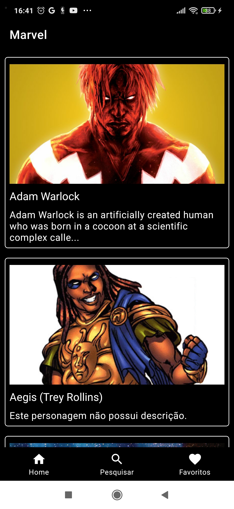
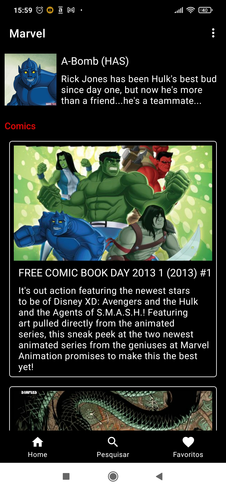
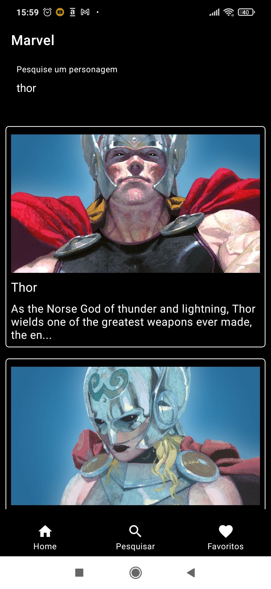
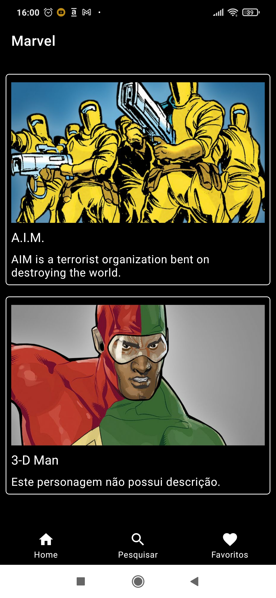

<h1 align="center">Marvel App</h1>

 
  
   
  
  
  

  

⭐ Esse é um projeto para demonstrar meu conhecimento técnico no desenvolvimento Android nativo com Kotlin. Mais informações técnicas abaixo.

App que lista personagens da marvel, trazendo a tela de detalhes com algumas informações do personagens, incluindo os comics/quadrinhos em que tal personagem está inserido.
Com funcionalidade de busca e favoritar personagem.  

 

## Download

Ou faça o download da <a href="apk/app-debug.apk?raw=true">APK diretamente</a>. Você pode ver <a href="https://www.google.com/search?q=como+instalar+um+apk+no+android">aqui</a> como instalar uma APK no seu aparelho android.

## Tecnologias usadas e bibliotecas de código aberto

- Nível mínimo do SDK : 23
- [Linguagem Kotlin](https://kotlinlang.org/) 

- Jetpack Compose
  - Lifecycle: Observe os ciclos de vida do Android e manipule os estados da interface do usuário após as alterações do ciclo de vida.
  - ViewModel: Gerencia o detentor de dados relacionados à interface do usuário e o ciclo de vida. Permite que os dados sobrevivam a alterações de configuração, como rotações de tela.
  - ViewBinding: Liga os componentes do XML no Kotlin através de uma classe que garante segurança de tipo e outras vantagens.
  - Sala: Biblioteca de abstração do banco de dados SQLite que garante segurança em tempo de construção e facilidade de uso.
  - Custom Views: View customizadas feitas do zero usando XML.
 

- Arquitetura
  - MVVM (View - ViewModel - Model)
  - Comunicação da ViewModel com a View através de LiveData
  - Comunicação da ViewModel com a Model através de Kotlin Flow
  - Repositories para abstração da comunicação com a camada de dados.
  
- Bibliotecas
  - [Retrofit2 & OkHttp3](https://github.com/square/retrofit): Para realizar requisições seguindo o padrão HTTP.
  - [Glide](https://github.com/bumptech/glide): Para carregamento de imagens e cacheamento das mesmas.
 
 
## Arquitetura

**Marvel app** utiliza a arquitetura MVVM e o padrão de Repositories, que segue as [recomendações oficiais do Google](https://developer.android.com/topic/architecture).
  

## API de terceiros

[Marvel Api](https://developer.marvel.com/docs#!/public/getCreatorCollection_get_0)

